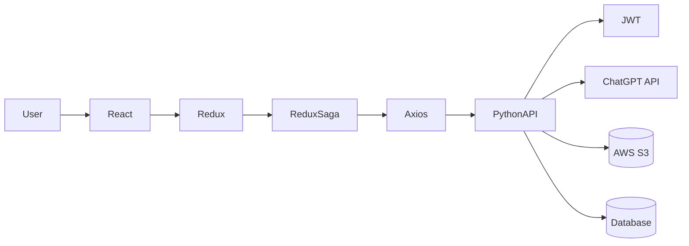
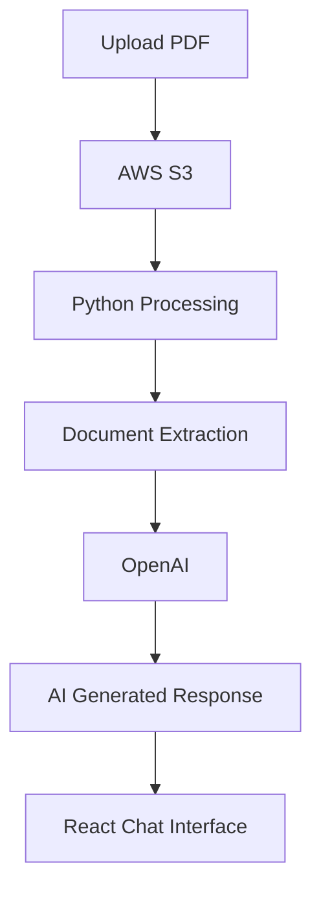
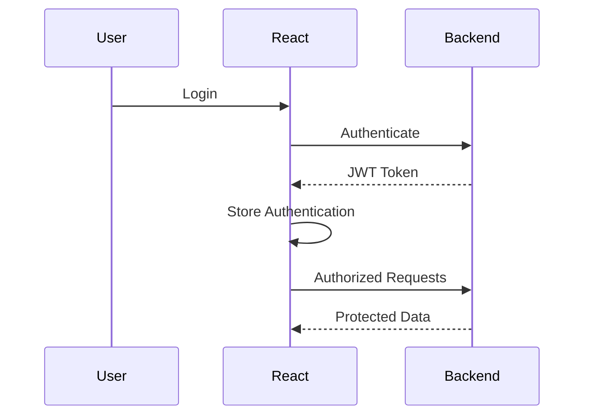
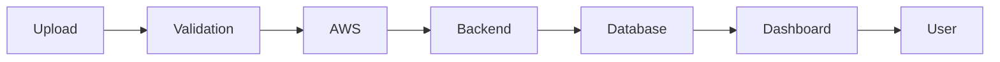
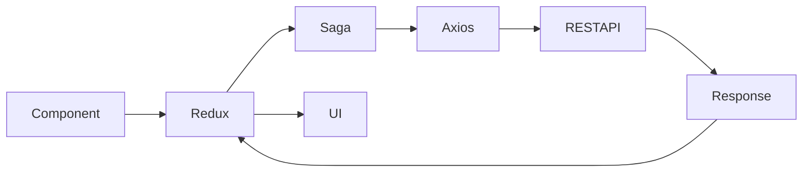

<div align="center">

# 🏡 Hobson

### AI-Powered Property Management SaaS

<p align="center">
Enterprise Property Management Platform featuring AI-powered document intelligence, conversational AI, document management, property administration, and role-based dashboards.
</p>

<p align="center">


</p>

---

### 🚀 Production Project

A modern enterprise Property Management SaaS built using **React**, **Redux Saga**, **Python APIs**, **AWS S3**, and **OpenAI** to provide intelligent document processing and AI-powered conversations.

---

</div>

# 📑 Table of Contents

- Overview
- Demo Videos
- Key Features
- Tech Stack
- System Architecture
- AI Document Intelligence
- Document Management
- Property & Unit Management
- Authentication Flow
- API Integration
- Frontend Architecture
- My Responsibilities
- Engineering Highlights
- Future Improvements

---

# 🎥 Product Demonstration

## 👨‍💼 Admin Panel

> Complete walkthrough of the Admin Dashboard

🎬 **Video**

[Admin-Demo.mp4](https://drive.google.com/file/d/13OJMovvEzv7UPWmRWi7QcW_7IrNPxbkK/view?usp=sharing)

---

## 👤 User Panel

> Complete walkthrough of the User Dashboard

🎬 **Video**

[User-Panel-Demo.mp4](https://drive.google.com/file/d/1WQgnBOt7G9XRB2ZCUTBp5lnE-57fNIA_/view?usp=sharing)

---

# 🌟 Overview

Hobson is an enterprise-grade Property Management SaaS designed to simplify document management, AI-assisted document understanding, property administration, and collaboration between organizations and users.

The platform combines traditional property management workflows with modern AI capabilities, allowing users to upload property documents, intelligently extract information, organize assets, and interact with documents through a conversational AI interface.

The frontend was built using **React (Vite)** with a scalable component architecture and integrates with Python-based backend services through REST APIs.

---

# ✨ Key Features

## 🤖 AI Powered Chat

- AI-assisted conversations
- Context-aware document discussions
- Intelligent responses
- Real-time message interface
- Chat history
- Conversation persistence

---

## 📄 Intelligent Document Management

- Upload PDF/Documents
- AWS S3 Storage
- Document Processing
- Metadata Management
- Search
- Filtering
- Preview
- Download
- Version Management

---

## 🏢 Property Management

- Company Management
- Building Management
- Unit Management
- Property Hierarchy
- Unit Assignment
- Interactive Property Organization

---

## 👥 User Management

- Authentication
- Authorization
- User Roles
- Team Members
- Invitations
- Company Administration

---

## ⚙ Administration

- Admin Dashboard
- User Dashboard
- Monitoring
- Analytics
- Management Tools

---

# 🛠 Technology Stack

| Category | Technologies |
|----------|--------------|
| Frontend | React (Vite) |
| Language | JavaScript / TypeScript |
| State Management | Redux + Redux Saga |
| HTTP Client | Axios |
| UI Library | Radix UI |
| Backend | Python APIs |
| AI | OpenAI ChatGPT |
| Storage | AWS S3 |
| Authentication | JWT |
| API Style | REST API |

---

# 🏗 High Level Architecture



---

# 🧠 AI Document Intelligence



The platform enables users to upload documents, intelligently process them, and ask natural language questions through an AI-powered conversational interface.

---

# 🔐 Authentication Flow



---

# ☁ Document Management Flow



---

# 🌐 API Communication



---

# ⚛ Frontend Architecture

```
React

│

├── Authentication

├── Dashboard

├── Company

├── Users

├── Documents

├── AI Chat

├── Properties

├── Units

├── Tags

├── Settings

└── Shared Components
```

---

# 👨‍💻 My Responsibilities

I was primarily responsible for the frontend development and integration of enterprise features within Hobson.

### Frontend Development

- Built modern React application using Vite
- Developed reusable UI components
- Implemented Redux architecture
- Managed asynchronous workflows using Redux Saga
- Integrated REST APIs using Axios
- Built AI Chat Interface
- Built Document Management UI
- Implemented Property & Unit Management
- Developed Admin Dashboard
- Developed User Dashboard
- Implemented Authentication
- Implemented Authorization
- AWS S3 Upload Integration
- Form Development
- Validation
- Search & Filtering
- Pagination
- Error Handling
- Responsive Design
- Performance Optimization

### Backend Collaboration

The backend services were developed by another developer/team.

My responsibilities included:

- Integrating frontend with backend APIs
- API contract implementation
- Authentication integration
- Error handling
- Loading states
- Data transformation
- User experience optimization

---

# ⭐ Engineering Highlights

✅ Enterprise Dashboard Architecture

✅ AI-powered Document Intelligence

✅ ChatGPT Integration

✅ AWS S3 Document Storage

✅ JWT Authentication

✅ Redux Saga State Management

✅ REST API Integration

✅ Modular React Architecture

✅ Reusable Components

✅ Responsive UI

✅ Scalable Folder Structure

✅ Enterprise-grade Forms

---

# 🙏 Acknowledgements

This repository showcases my frontend engineering contributions to the Hobson Property Management SaaS.

The focus of this portfolio is to demonstrate:

- Enterprise React Architecture
- Dashboard Development
- API Integration
- AI-powered User Experience
- Document Management Workflows
- Frontend Engineering Practices

---

<div align="center">

### ⭐ Thank you for visiting this repository.

If you'd like to discuss the implementation or my contributions, feel free to connect with me.

</div>
